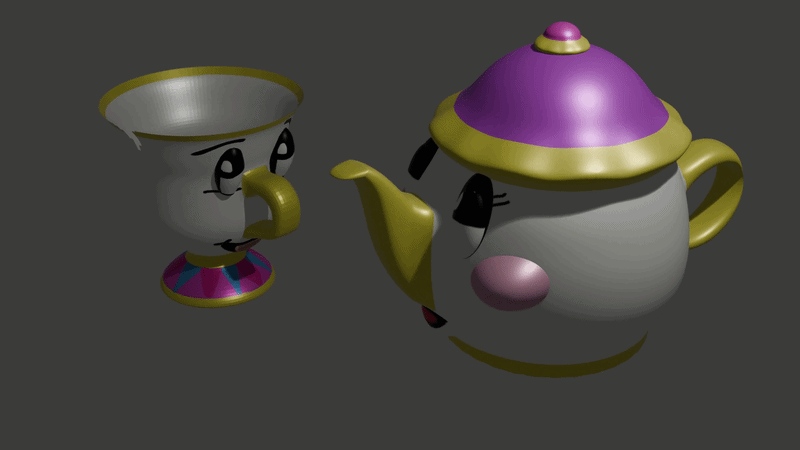

# 📋 Margarita Diamanti - Complete Portfolio

Welcome to my professional portfolio! I'm **Margarita Diamanti**, an Applied Informatics student at Macedonia University with a passion for web development, web design, and digital transformation.

---

## 🎯 About Me

I'm a creative problem-solver and developer passionate about:
- **Web Development** - Building responsive, user-friendly websites
- **Web Design** - Creating beautiful, intuitive digital experiences
- **3D Design & Modeling** - Bringing ideas to life through digital art
- **Digital Marketing** - Connecting products with audiences

**📧 Contact:** margi.diam@gmail.com  
**🎓 Education:** Macedonia University - Applied Informatics  
**📍 Location:** Greece

---

## 💼 Featured Projects

### 🌐 Dev Tech Vision Consulting Website
**Type:** Web Development | **Status:** Live ✅

My first professional website project—a complete web solution for a consulting brand.

- **Live Site:** https://dev-tech-vision-consulting.pantheonsite.io/
- **Features:** Responsive design, professional branding, service showcase
- **Technologies:** HTML, CSS, JavaScript, WordPress/Pantheon
- **Outcome:** Fully functional, deployed consulting website

📁 **Project Details:** [View Full Project](./projects/dev-tech-vision/)

---

### 🎨 3D Design & Modeling Portfolio

A collection of 3D models and character designs showcasing digital art and product visualization expertise.

#### Featured Designs:
- **Mrs. Teapot** - Whimsical character teapot with detailed texturing
- **Chip Character** - Playful product character design
- **Teapot Prototype** - Functional design with realistic materials
- **Traditional Greek Objects** - Cultural 3D renderings

**Skills:** 3D Modeling • Texturing • Lighting • Rendering • Character Design

📁 **Project Details:** [View Full 3D Portfolio](./projects/3d-design/)

---

## 📚 Research & Academic Work

### ΤΕΛΙΚΗ ΕΡΕΥΝΑ (Final Research)
**Language:** Greek | **Type:** Academic Research  

A comprehensive research study demonstrating:
- Advanced research methodology
- Data analysis and interpretation
- Academic writing standards

📁 **View Documents:** [Research Folder](./research/)

---

## 🛠️ Skills & Competencies

### Web Development
- HTML5 / CSS3 / JavaScript
- Responsive Design
- WordPress / CMS Platforms
- Web Hosting & Deployment
- UX/UI Principles

### Design & 3D
- 3D Modeling & Sculpting
- Texture Creation & UV Mapping
- Lighting & Rendering
- Product Visualization
- Character Design

### Professional
- Project Management
- Digital Marketing Concepts
- Academic Research
- Bilingual Communication (Greek/English)

---

## 🎓 Education

**Macedonia University**  
Applied Informatics Program

**Key Coursework:**
- Web Development
- Digital Design
- Information Systems
- Research Methods

---

## 🚀 Future Goals

- Expand web development portfolio with advanced projects
- Develop interactive 3D web experiences
- Combine web and 3D skills for immersive digital products
- Explore modern frameworks and technologies
- Build client-focused solutions

---

## 📫 Let's Connect!

I'm always interested in discussing:
- Web development opportunities
- Design collaboration
- Student projects and learning
- Career growth in tech

**Email:** margi.diam@gmail.com  
**GitHub:** https://github.com/margidiam  

---

**Last Updated:** June 2026
