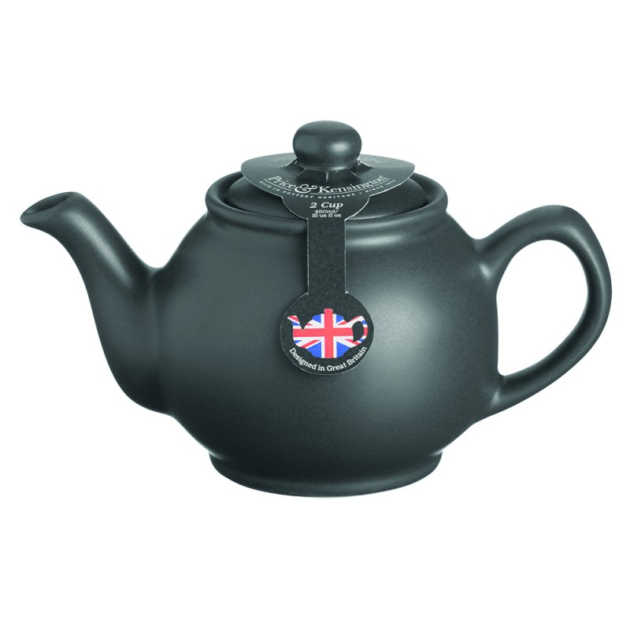

# 3D Design & Modeling Projects

## Project Overview
Collection of 3D design and modeling work showcasing digital art and product visualization skills.

## Details
- **Type:** 3D Modeling & Design
- **Tools Used:** Blender, 3D Studio Max, or similar 3D software
- **Status:** ✅ Completed Designs

## Designs Included

### Mrs. Teapot
A whimsical 3D teapot character design with personality and detail.
- **File:** mrs-teapot-base-color.png
- **Description:** Character-styled teapot with detailed texturing

### Chip Character
A playful 3D chip character model with base color texture.
- **File:** chip-base-color.png
- **Description:** Product character design with professional texturing

### Traditional Greek Design
A cultural 3D model featuring traditional Greek aesthetics.
- **File:** πρότυπο_θριψαλάκι.png
- **Description:** Greek traditional object 3D rendering

### Teapot Prototype
Detailed prototype design of a traditional teapot.
- **File:** πρότυπο_τσαγιέρας.jpg
- **Description:** Functional teapot design with realistic materials

## Skills Demonstrated
- 3D Modeling & Sculpting
- Texture Creation & UV Mapping
- Lighting & Rendering
- Material Design
- Character Design

## Design Process
1. Concept development
2. 3D modeling
3. Topology optimization
4. Texturing & Material application
5. Lighting setup
6. Rendering & Post-processing

## Future Directions
- Animated character rigging
- Real-time rendering (game engine integration)
- Commercial product visualization
- Interactive 3D web experiences

## Gallery

| Design | Image |
|--------|-------|
| Mrs. Teapot |  |
| Chip Character |  |
| Teapot Prototype |  |
| Greek Design |  |
